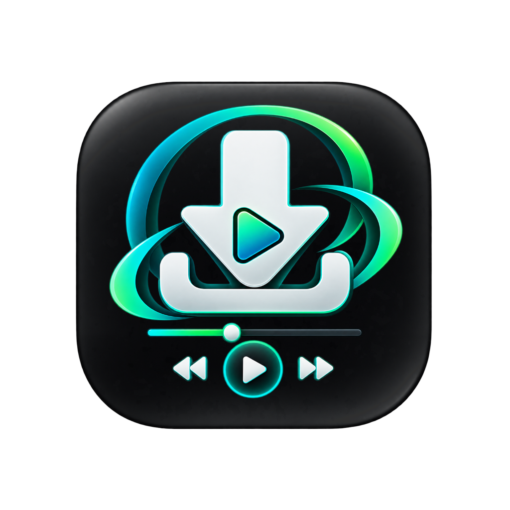
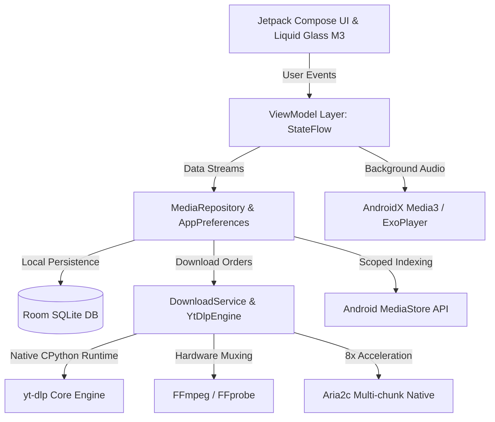

<p align="center">
  
</p>

<h1 align="center">Zyvro</h1>

<p align="center">
  <strong>The Next-Generation Universal Android Media Downloader & Offline Player</strong><br>
  Powered by <strong>yt-dlp</strong>, <strong>FFmpeg</strong>, <strong>Aria2c</strong>, and <strong>Jetpack Compose (Material 3 Liquid Glass)</strong>
</p>

<p align="center">
  <a href="https://github.com/Rishav7324/zyvro/releases/tag/v3.0.2"></a>
  <a href="https://github.com/Rishav7324/zyvro/actions/workflows/build-apk.yml"></a>
  <a href="https://github.com/Rishav7324/zyvro/blob/main/LICENSE"></a>
  <a href="https://github.com/Rishav7324/zyvro/wiki"></a>
  <a href="https://github.com/Rishav7324/zyvro/stargazers"></a>
</p>

<p align="center">
  <a href="#-quick-download">📥 Download APK</a> •
  <a href="#-key-features">✨ Features</a> •
  <a href="#-supported-platforms">🌐 Supported Sites</a> •
  <a href="#-architecture">🏗️ Architecture</a> •
  <a href="#-build-from-source">🛠️ Build from Source</a> •
  <a href="https://github.com/Rishav7324/zyvro/wiki">📖 Full Wiki</a>
</p>

---

## 📥 Quick Download

Get the latest official APKs directly from GitHub Releases:

| Variant | Download Link | Architecture | Target | Size |
| :--- | :--- | :---: | :--- | :---: |
| **arm64-v8a (Recommended)** | [**Download Zyvro-v3.0.2-arm64-v8a.apk**](https://github.com/Rishav7324/zyvro/releases/download/v3.0.2/Zyvro-v3.0.2-arm64-v8a.apk) | 64-bit ARM | 95%+ of modern Android phones (Snapdragon, MediaTek, Exynos, Tensor) | **~35 MB** 🔥 |
| **armeabi-v7a** | [**Download Zyvro-v3.0.2-armeabi-v7a.apk**](https://github.com/Rishav7324/zyvro/releases/download/v3.0.2/Zyvro-v3.0.2-armeabi-v7a.apk) | 32-bit ARM | Older or budget 32-bit Android devices | **~32 MB** |
| **Universal APK** | [**Download Zyvro-v3.0.2-universal.apk**](https://github.com/Rishav7324/zyvro/releases/download/v3.0.2/Zyvro-v3.0.2-universal.apk) | All ABIs | All devices and PC emulators (Fallback) | ~136 MB |

> **Requirement:** Android 8.0 (Oreo / API 26) through Android 15 (Vanilla Ice Cream / API 35).

---

## ✨ Key Features

### 🎨 Liquid Glass Material 3 Design System
* **Modern Glass Aesthetics**: Translucent surfaces, edge-to-edge layout, acrylic glass blur backdrops, and jewel accents (`NovaAqua`, `NovaPrimary`).
* **Interactive Platform Hub**: Glowing quick-access platform chips for 1-tap paste & search.
* **Smart Format Selection**: Dynamic dual tabs separating **Photo / Image** downloads from **Video & Audio** streams.
* **Storage Breakdown Visualizer**: In-app categorized storage meter (Videos, Audio, Photos) with 1-tap cache cleaner.

### ⚡ Meta & Social Media Engine Fix
* **Anti-Redirect Bypass**: Automated Chrome Desktop User-Agent injection preventing 302 login redirects on Instagram and Facebook.
* **Tracking Stripper**: Automatically strips tracking queries (`?igsh=`, `?mibextid=`, `fbclid=`, `?xmt=`).
* **Progressive Stream Engine**: Direct single-stream fallback (`b/best`) for Reels and Stories.
* **Instagram Photos & Carousels**: Full support for downloading multi-slide photos and single pictures without video conversion errors.

### ✂️ Lossless Audio Cutter & Ringtone Maker
* **Zero Quality Loss**: Hardware-accelerated trimming powered by Android `MediaExtractor` and `MediaMuxer` without lossy re-encoding.
* **Interactive Waveform**: Fine-grained millisecond start/end markers with real-time looping preview.
* **1-Tap System Export**: Directly set any trimmed segment as your **Phone Ringtone** or **Notification Alert** via Android's `RingtoneManager`.

### 🚀 Aria2c Multi-Connection Turbo Acceleration
* Multi-source segmented chunk downloader (`libaria2c.so`) providing up to **8x faster downloads** on high-speed connections.
* Seamless automatic fallback to native yt-dlp chunking if disabled.

### 🎧 Background Lockscreen Audio Player
* Integrated with **AndroidX Media3 (ExoPlayer)** and Android foreground playback service.
* Lockscreen transport controls: Play, Pause, Next, Previous, and Track Cover Art.
* Persistent mini-player bar allowing you to browse Zyvro while listening.

### 📂 Android 10–15 Scoped Storage & MediaStore Sync
* Direct insertion into `MediaStore.Video`, `MediaStore.Images`, and `MediaStore.Audio` with `IS_PENDING` safety flags.
* All downloaded media is immediately indexed by system Gallery, Google Photos, and music players without requiring manual file refresh.

### 🎛️ Bandwidth Limiter & Custom Directories
* Download speed limiter (500 KB/s, 2 MB/s, 5 MB/s, 10 MB/s, or Unlimited).
* Auto-resume downloads over Wi-Fi to preserve mobile data.
* Custom download directory picker with external SD card support.

### 🍪 Privacy & Authentication
* Import standard Netscape-formatted `cookies.txt` for age-restricted or member-only YouTube & Instagram media.
* Stored strictly in local app sandbox; no third-party telemetry, analytics, or cloud tracking.

---

## 🌐 Supported Platforms

Zyvro integrates `yt-dlp` supporting over **1,000+ sites**, including:

| Platform | Videos / Reels | Photos / Carousels | Audio Extraction | Resilient Streaming |
| :--- | :---: | :---: | :---: | :---: |
| **YouTube** | ✅ (Up to 4K/8K) | ❌ | ✅ (MP3, M4A, Opus, FLAC) | Android Player Client |
| **Instagram** | ✅ (Reels & Stories) | ✅ (Full HD) | ✅ (Original Audio) | Anti-302 Redirect Bypass |
| **Facebook** | ✅ (Reels & Watch) | ❌ | ✅ | Tracking Stripped |
| **Threads** | ✅ | ✅ | ✅ | Progressive Native Stream |
| **Pinterest** | ✅ | ✅ | ✅ | Shortlink Expansion (`pin.it`) |
| **TikTok** | ✅ (No Watermark) | ❌ | ✅ | High Bitrate MP4 |
| **Twitter / X** | ✅ (Multi-res) | ❌ | ✅ | Best Quality Stream |
| **Reddit** | ✅ (Merged Audio/Video) | ❌ | ✅ | FFmpeg Native Muxing |
| **SoundCloud** | ❌ | ❌ | ✅ (HQ Tracks) | Album Artwork Metadata |
| **Twitch** | ✅ (VODs & Clips) | ❌ | ✅ | Multi-threaded Chunking |
| **Bilibili** | ✅ | ❌ | ✅ | Custom Header Injection |

---

## 🏗️ Architecture & Internals



### 🧱 Tech Stack Overview

| Area | Component | Description |
| :--- | :--- | :--- |
| **Language** | Kotlin 2.0+ | Modern coroutines, Flow, and Kotlin DSL. |
| **UI Framework** | Jetpack Compose + Material 3 | Declarative UI with Liquid Glass aesthetics. |
| **Architecture** | MVVM + Clean Architecture | Unidirectional Data Flow (UDF) and Repository Pattern. |
| **Core Download Engine** | yt-dlp + you-get wrapper | Embedded Python runtime (`libpython.so`). |
| **Media Processing** | FFmpeg & FFprobe | Native format conversion and audio extraction (`libffmpeg.so`). |
| **Multi-chunk Engine** | Aria2c | High-speed concurrent download daemon (`libaria2c.so`). |
| **Audio/Video Playback**| AndroidX Media3 (ExoPlayer 1.5.1) | Hardware-accelerated background playback & notifications. |
| **Persistence** | Room DB + DataStore | Reactive database caching and key-value preferences. |
| **Image Loading** | Coil Compose | Asynchronous image loading with memory & disk cache. |
| **Build System** | Gradle 8.11 + AGP 8.8 | Kotlin DSL with automated GitHub Actions CI/CD. |

---

## 🛠️ Build from Source

### Requirements
* Android Studio Ladybug (2024.2+) or newer
* JDK 21 (Temurin or OpenJDK)
* Android SDK Platform 35
* Git

### Step-by-Step Build

```bash
# 1. Clone the repository
git clone https://github.com/Rishav7324/zyvro.git
cd zyvro

# 2. Grant gradlew execution permissions
chmod +x gradlew

# 3. Clean and build Debug APK
./gradlew clean assembleDebug

# Output APK: app/build/outputs/apk/debug/app-debug.apk

# 4. (Optional) Build Release APK
./gradlew assembleRelease

# Output APK: app/build/outputs/apk/release/app-release.apk
```

---

## 📖 Wiki & Extended Documentation

Visit our full **[Zyvro GitHub Wiki](https://github.com/Rishav7324/zyvro/wiki)** for detailed guides:
* **[Installation & Permissions Setup](https://github.com/Rishav7324/zyvro/wiki/Installation-&-Setup)**
* **[Supported Platforms & Format Selection](https://github.com/Rishav7324/zyvro/wiki/Supported-Platforms-&-Formats)**
* **[Audio Cutter & Ringtone Guide](https://github.com/Rishav7324/zyvro/wiki/Audio-Cutter-&-Ringtone-Guide)**
* **[Cookies & Authentication Guide](https://github.com/Rishav7324/zyvro/wiki/Cookies-&-Authentication)**
* **[Architecture & Internals Deep Dive](https://github.com/Rishav7324/zyvro/wiki/Architecture-&-Internals)**
* **[FAQ & Troubleshooting](https://github.com/Rishav7324/zyvro/wiki/FAQ-&-Troubleshooting)**

---

## 🤝 Contributing

Contributions are welcome! Please feel free to open a Pull Request or report bugs and feature requests on [Issues](https://github.com/Rishav7324/zyvro/issues).

---

## ⚖️ License

Zyvro is free and open-source software licensed under the **GNU General Public License v3.0 or later**. See [LICENSE](LICENSE) for details.

Third-party open-source components:
* [yt-dlp](https://github.com/yt-dlp/yt-dlp) (Unlicense)
* [FFmpeg](https://ffmpeg.org/) (LGPL v2.1+ / GPL v2+)
* [Aria2](https://github.com/aria2/aria2) (GPL v2)
* [AndroidX](https://developer.android.com/jetpack/androidx) & [Jetpack Compose](https://developer.android.com/jetpack/compose) (Apache 2.0)
* [Media3](https://developer.android.com/media/media3) (Apache 2.0)
* [Coil](https://github.com/coil-kt/coil) (Apache 2.0)

---

<p align="center">
  Crafted with care by <strong>Rishav Raj</strong> (<a href="https://github.com/Rishav7324">@Rishav7324</a>)<br>
  Star ⭐ this repository if you find Zyvro useful!
</p>
