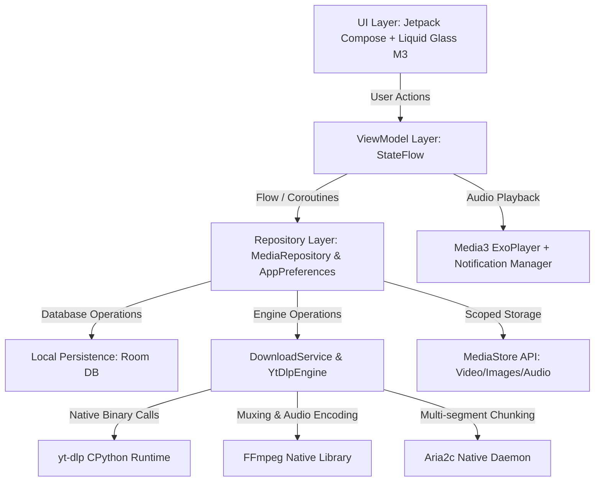

# Architecture & Internals 🏗️

Zyvro is engineered with modern Android best practices, adhering to clean architecture principles with decoupled layers, unidirectional data flow (UDF), and reactive state management.

---

## 🏛️ Architecture Overview

---

## 📦 Core Subsystems

### 1. Presentation Layer (Jetpack Compose)
* **Design System**: Liquid Glass Material 3 theme (`com.zyvro.app.ui.theme`). Uses semi-transparent glass cards, blur backdrops, jewel accent glows (`NovaAqua`, `NovaPrimary`), and squircle borders.
* **Component Library**: Includes reusable building blocks such as `LiquidGlassCard`, `FormatSelectionSheet`, `VideoPreviewCard`, `AudioTrimmerDialog`, and `AudioPlayerSheet`.
* **State Management**: Screens observe immutable `StateFlow` streams from ViewModels. Side effects and single-shot events are channeled via Kotlin Coroutine Channels.

### 2. Download Engine (`YtDlpEngine.kt`)
* **Process Execution**: Executes `yt-dlp` in a sandboxed sub-process using the `you-get`/`youtube-dl-android` wrapper.
* **Stream Fallbacks**: Dynamically builds format arguments:
  - High-res YouTube: `bv*[height<=1080]+ba/b[height<=1080]/best`
  - Meta & Reels: Progressive `b/best` or `$formatId/best` to prevent audio/video stream mismatches.
  - Social Photo Carousels: Suppresses video output formatting to write raw image binaries.
* **Aria2 Acceleration**: Spawns native `libaria2c.so` as an external downloader with 4–8 concurrent connection fragments per file.

### 3. Foreground Download Service (`DownloadService.kt`)
* Runs as an Android Foreground Service with high-priority ongoing notifications.
* Emits real-time progress callbacks (`progressPercentage`, `speedString`, `etaString`).
* Responds to system pause, resume, and cancel intents.
* Supports **Wi-Fi Auto-Resume** by monitoring Android's `ConnectivityManager` network capabilities.

### 4. Storage & MediaStore Synchronization (`StorageHelper.kt`)
* Fully compliant with **Android 10 through Android 15 Scoped Storage** requirements.
* Inserts media records into `MediaStore.Video.Media.EXTERNAL_CONTENT_URI`, `MediaStore.Images.Media.EXTERNAL_CONTENT_URI`, and `MediaStore.Audio.Media.EXTERNAL_CONTENT_URI`.
* Uses `MediaStore.IS_PENDING = 1` during download, and switches to `0` upon completion to trigger Android's native media scanner without duplicate files.

### 5. Playback Engine (`MediaPlayerManager.kt`)
* Uses **AndroidX Media3 (ExoPlayer 1.5.1)**.
* Integrated with `MediaNotificationManager` providing lockscreen playback controls, notification art, and hardware headset button dispatching.
* Exposes playback state as reactive state flows to the mini-player bar and the full-screen playback sheet.

---

## 🛠️ Native Libraries (JNI / ABI)

Zyvro packages native shared libraries (`.so`) compiled for major Android architectures:
* `arm64-v8a` (Modern 64-bit phones)
* `armeabi-v7a` (Older 32-bit devices)
* `x86_64` (Android Emulators & Chromebooks)

Native binaries bundled:
* `libpython.so`: Embedded Python runtime for yt-dlp execution.
* `libffmpeg.so` & `libffprobe.so`: Hardware/software media muxer.
* `libaria2c.so`: Multi-source download utility.
